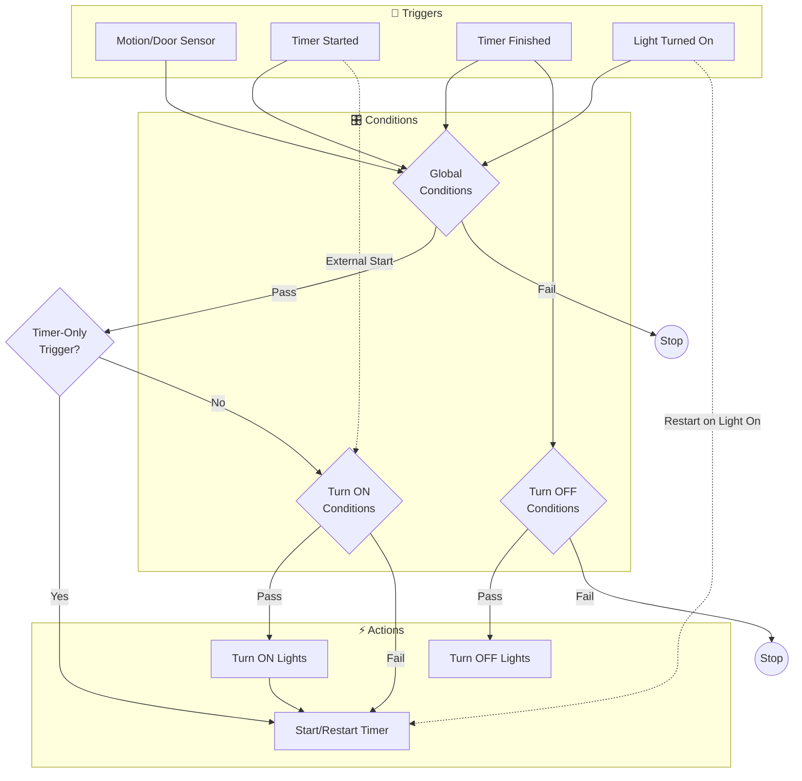

# 🏠 Home Assistant Blueprints

## 💡 Timer-Based Lighting Automation

> **v2026.01.26** • by Dima Tokar • Requires HA 2025.1.0+

Motion-activated lighting with smart timer management. Lights turn on when triggered, stay on while there's activity, and turn off when the timer expires.

📖 [Read more on my blog](https://www.dima.pm/timer-based-lighting-blueprint-for-home-assistant/)

### ✨ Features

| Feature | Description |
|---------|-------------|
| 🎯 **Flexible Triggers** | Motion sensors, door sensors, or any state-based entity |
| ⏱️ **Timer Integration** | Uses HA's built-in timer helper |
| 🔄 **Auto-Restart** | Timer restarts with each trigger event |
| 🎛️ **Timer-Only Mode** | Some sensors can maintain lights without activating them |
| 🔀 **Conditions** | Global, turn-on, and turn-off conditions |
| 🏷️ **Multi-Target** | Lights, areas, devices, and labels |

### 📥 Import

```
https://github.com/dimatx/home-assistant/blob/main/blueprints/timer_driven_lighting_blueprint.yaml
```

---

### ⚙️ Configuration

<details>
<summary><b>Required Settings</b></summary>

- **Timer Entity** — Timer helper to track duration
- **Lights to Control** — Target lights/areas/devices/labels
- **Trigger Entities** — Sensors that trigger the automation
- **Trigger States** — States that activate (default: `on`)

</details>

<details>
<summary><b>Conditions</b></summary>

- **Global** — Must be met for any action
- **Turn ON** — Additional requirements to turn lights on
- **Turn OFF** — Additional requirements to turn lights off

</details>

<details>
<summary><b>Advanced Settings</b></summary>

- **Timer Duration** — Override the timer helper's default
- **Restart on Light On** — Restart timer when lights are turned on externally
- **Timer-Only Triggers** — Sensors that restart timer but don't turn on lights
- **Debug Mode** — Log debug info for troubleshooting

</details>

---

### 🔄 How It Works

```
Activity detected → Timer starts → Lights ON
       ↓
More activity → Timer restarts → Lights stay ON
       ↓
No activity → Timer expires → Lights OFF
```

---

### 💡 Example Use Cases

| Use Case | Setup |
|----------|-------|
| 🚿 **Bathroom** | Motion sensor + 5 min timer |
| 🛋️ **Living Room** | PIR to turn on, mmWave (timer-only) to maintain |
| 🚪 **Entryway** | Door + motion sensors combined |
| 🌙 **Night-Only** | Add sunset/sunrise condition |

---

## 📚 Detailed Logic Reference

### 🗺️ Flow Diagram



<details>
<summary><b>🔌 Triggers</b></summary>

| Trigger ID | Event |
|------------|-------|
| `timer_active` | Timer started |
| `timer_idle` | Timer finished |
| `entity_triggered` | Sensor state changed |
| `light_turned_on` | Monitored light turned on externally |

</details>

<details>
<summary><b>🌳 Action Branches</b></summary>

**Branch 1: Activity Detected**
- Trigger matches → Turn on lights (if not timer-only) → Start timer

**Branch 1b: Light Turned On**
- External light activation → Restart timer

**Branch 2: Timer Started Externally**
- Timer started by script/manual → Turn on lights
- *Skipped when this automation started the timer*

**Branch 3: Timer Finished**
- Timer expires + turn-off conditions met → Turn off lights

**Branch 4: Delayed Turn-Off**
- Timer already idle + turn-off conditions now met → Turn off lights
- *Catches cases where turn-off was previously blocked*

</details>

<details>
<summary><b>🎛️ Timer-Only Triggers</b></summary>

For sensors that should **maintain** lights but not **activate** them:

| Sensor | Recommended |
|--------|-------------|
| PIR motion | Normal trigger |
| mmWave presence | Timer-only |
| Door sensor | Normal trigger |

**Hybrid setup:** PIR turns on lights, mmWave keeps them on.

</details>

<details>
<summary><b>🔗 Context-Based Self-Detection</b></summary>

The blueprint uses HA's context system to prevent loops:

- Ignores lights it turned on itself
- Skips redundant actions when it started the timer

</details>
